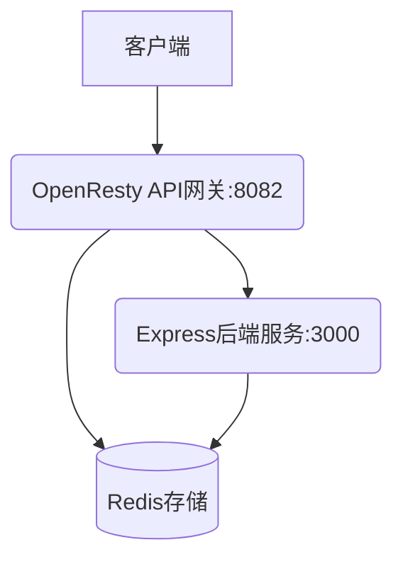

# API网关系统

基于OpenResty和国密算法的企业级API网关系统，提供安全、高性能的API管理服务。

## 系统特性

- **国密算法支持**: 使用SM2、SM3、SM4算法进行签名、哈希和加密
- **安全防护**: 防重放攻击、IP白名单、签名验证
- **高性能**: 基于OpenResty和LuaJIT的高性能网关
- **实时配置**: 无缓存设计，所有配置实时从Redis获取
- **监控统计**: 完整的请求日志和统计信息

## 系统架构



## 快速部署

### 1. 在Windows上准备文件

确保项目结构如下：
```
software/
├── openresty/          # 已编译的OpenResty
├── express/            # Express后端代码
└── scripts/            # 管理脚本
```

### 2. 上传到服务器

```bash
# 修改服务器配置
vim scripts/deploy_to_server.sh

# 运行部署脚本
./scripts/deploy_to_server.sh
```

### 3. 在服务器上初始化

```
# 使用统一配置初始化网关（推荐）
cd /opt/zy/software/scripts
./init_gateway.sh

# 或者分别初始化
# 初始化Redis数据
cd /opt/zy/software/scripts
./init_redis_data.sh

# 启动服务
./start_gateway.sh

# 检查状态
./status_gateway.sh

# 测试服务
./test_gateway.sh
```

## 配置管理

### 统一配置文件

系统使用项目根目录下的 `.env` 文件来统一管理所有配置：

```bash
# 查看当前配置
cd /opt/zy/software/scripts
./init_gateway.sh --show-config
```

### 配置初始化脚本

新增的 `init_gateway.sh` 脚本可以：
- 读取 `.env` 文件中的配置
- 自动更新相关配置文件
- 初始化Redis数据

```bash
# 完整初始化（更新配置并初始化Redis）
./init_gateway.sh

# 仅更新配置文件
./init_gateway.sh --config-only

# 仅初始化Redis数据
./init_gateway.sh --redis-only
```

## 管理脚本

| 脚本 | 功能 |
|------|------|
| `start_gateway.sh` | 启动API网关服务 |
| `stop_gateway.sh` | 停止API网关服务 |
| `restart_gateway.sh` | 重启API网关服务 |
| `status_gateway.sh` | 查看服务状态 |
| `test_gateway.sh` | 测试服务功能 |
| `init_redis_data.sh` | 初始化Redis数据 |
| `init_gateway.sh` | 统一配置初始化 |

## 服务访问

- **网关服务**: http://localhost:8082
- **后端服务**: http://localhost:3000
- **健康检查**: http://localhost:8082/health

## 配置说明

### 路径配置
- OpenResty: `/opt/zy/software/openresty`
- Express: `/opt/zy/software/express`
- 脚本: `/opt/zy/software/scripts`

### 端口配置
- 网关端口: 8082
- 后端端口: 3000
- Redis: 192.168.56.2:6379

## 安全特性

1. **国密算法**: SM2签名、SM3哈希、SM4对称加密
2. **防重放攻击**: 基于nonce和时间戳的防重放机制
3. **IP白名单**: 限制访问来源
4. **签名验证**: 确保请求完整性和来源可信
5. **加密传输**: 请求和响应都经过SM4加密
6. **实时配置**: 无缓存设计，配置变更立即生效

## 实时配置

API网关采用无缓存设计，所有配置信息（包括App信息、API信息、订阅关系等）都实时从Redis获取：

### 1. 配置实时生效

当Redis中的配置发生变化时，网关会在下一次请求中立即使用新配置，无需任何延迟或重启操作。

### 2. 密钥轮换

```bash
# 更新App密钥
cd /opt/zy/software/express
node test_key_rotation.js update app_001

# 发送测试请求验证新密钥立即生效
node test_client.js single POST /api/user/create '{"name":"Test User","email":"test@example.com"}'
```

### 3. 配置更新

所有配置变更（如API路径修改、订阅关系调整等）都会在下一次请求中立即生效。

## 使用示例

### 1. 生成测试密钥

```bash
cd /opt/zy/software/express
node test_client.js
```

### 2. 测试API调用

```bash
cd /opt/zy/software/express
node test_client.js test
```

### 3. 查看日志

```bash
# 后端日志
tail -f /opt/zy/software/express/backend.log

# 网关日志
tail -f /opt/zy/software/openresty/nginx/logs/api_gateway_access.log
```

## 故障排除

### 常见问题

1. **端口被占用**
   ```bash
   netstat -tlnp | grep -E "(8082|3000)"
   kill -9 <PID>
   ```

2. **Redis连接失败**
   ```bash
   redis-cli -h 192.168.56.2 -p 6379 ping
   ```

3. **服务启动失败**
   ```bash
   ./status_gateway.sh
   tail -f /opt/zy/software/express/backend.log
   ```

4. **签名验证失败**
   ```bash
   # 检查密钥是否一致
   node test_key_rotation.js show app_001
   ```

## 项目结构

```
openresty/nginx/lua/api_gateway/
├── sm_crypto_utils.lua      # 国密算法工具
├── redis_utils.lua          # Redis操作工具
├── request_validator.lua    # 请求验证
├── response_handler.lua     # 响应处理
└── gateway.lua              # 主网关入口

express/
├── index.js                 # 后端服务
├── test_client.js           # 测试客户端
├── init_redis_data.js       # Redis数据初始化
├── test_key_rotation.js     # 密钥轮换测试
└── package.json             # 依赖配置

scripts/
├── start_gateway.sh         # 启动脚本
├── stop_gateway.sh          # 停止脚本
├── restart_gateway.sh       # 重启脚本
├── status_gateway.sh        # 状态检查
├── test_gateway.sh          # 测试脚本
└── init_redis_data.sh       # 数据初始化
```

## 许可证

MIT License

## 联系方式

如有问题，请查看日志文件或运行状态检查脚本。